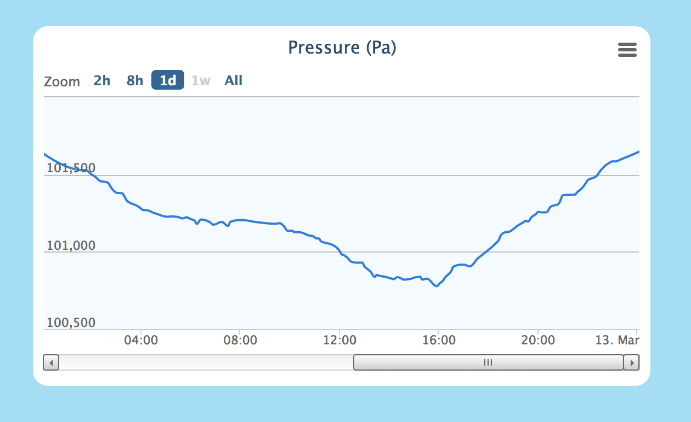
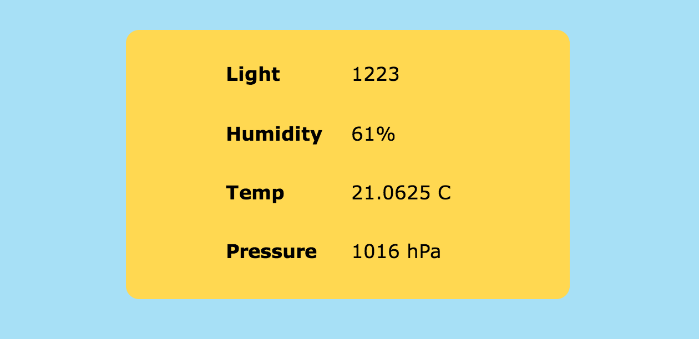

RoomMonitor
===========

Room Environment Monitor on pcDuino

:warning: This project is archived and no longer used by me. Please check https://github.com/yelite/home-system-room-node for its successor.

### Features

- Pressure, temperature, humidity and luminous intensity measurement
- Web interface to check the current value as well as historical data

### Sensors
- BMP085/180 (Used library from [Adafruit](https://github.com/adafruit/Adafruit-BMP085-Library))
- DHT
- Photoresistor module

### Screen Shots

### Install
1. Build C/C++ sensor modules

		$ make all
2. Edit `fetch.py` to match your sensor pin configuration
3. Create cron job for `fetch.py`

		$ crontab -e
		###
		*/5 * * * * /usr/bin/python <path>/fetch.py
		# fetch data every 5 minutes
4. Run the web server

		$ python main.py
or

		$ gunicorn -c gunicorn_config.py main:app

### Built by
- [Flask](flask.pocoo.org)
- [SQLAlchemy](www.sqlalchemy.org) (An overkill for this case, but I like it :)
- [Highstock](http://www.highcharts.com/)

### License
This project is licensed under the [MIT license](http://opensource.org/licenses/MIT).
